# IT Service Desk & Asset Inventory Lab

**Tools:** osTicket · MySQL · XAMPP · phpMyAdmin

A two part lab that mirrors real IT support work: a deployed help desk
ticketing system (osTicket) and a SQL asset inventory database. Built to
practice the day-to-day workflows of an IT operations / service desk role (ticket triage, SLAs, and hardware tracking.)

> All names, companies, and data in this project are fictional sample data.

---

## Part 1: Help Desk (osTicket)

Deployed osTicket v1.18.4 on a local LAMP stack, then configured
departments, SLA plans, and walked realistic tickets through their full
lifecycle from submission to resolution.

### The environment
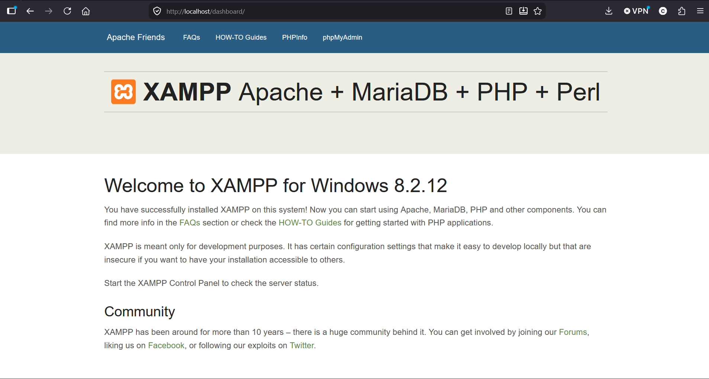
*Local LAMP stack (Apache + MariaDB + PHP 8.2) running via XAMPP (the environment osTicket is deployed on)*

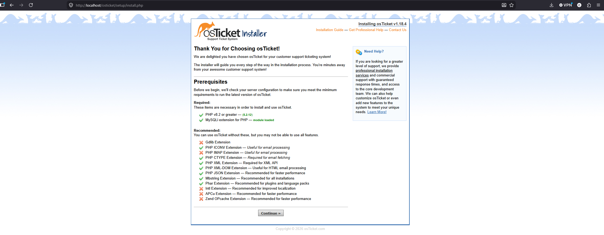
*osTicket v1.18.4 install, server prerequisites check passing (PHP 8.2, MySQLi).*

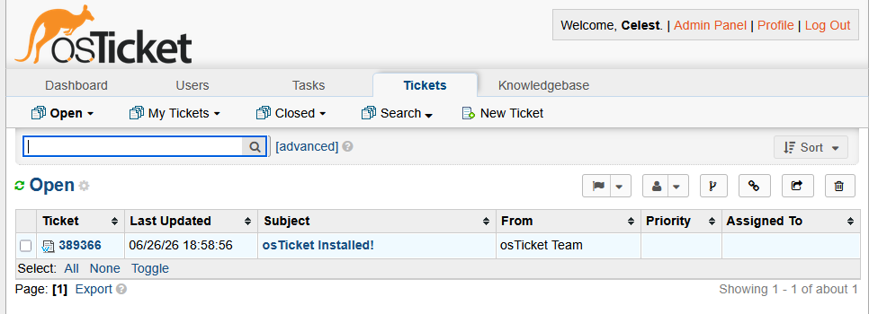
*osTicket successfully installed and running, logged into the agent panel.*

### Configuration
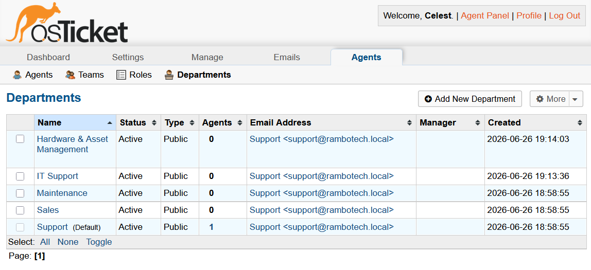
*Configured departments, including custom IT Support and Hardware & Asset Management queues for routing tickets to the right team.*

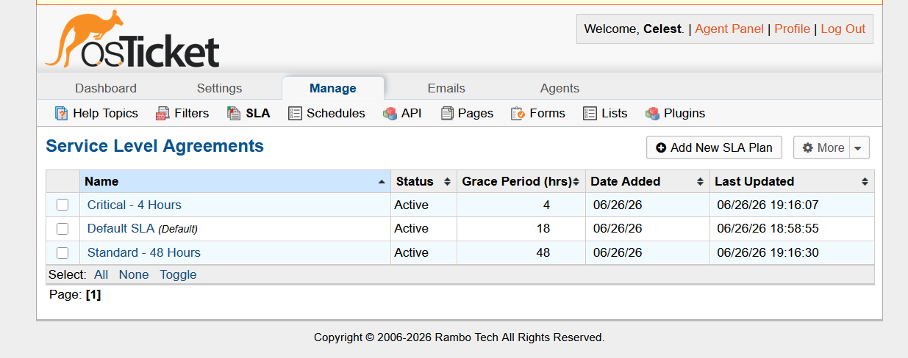
*Configured SLA tiers: Critical (4 hr) and Standard (48 hr), each with an overdue grace period.*

### Ticket lifecycle
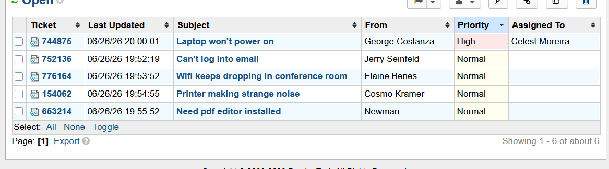
*Active ticket queue with realistic sample tickets across multiple issue types (login, connectivity, hardware, software).*

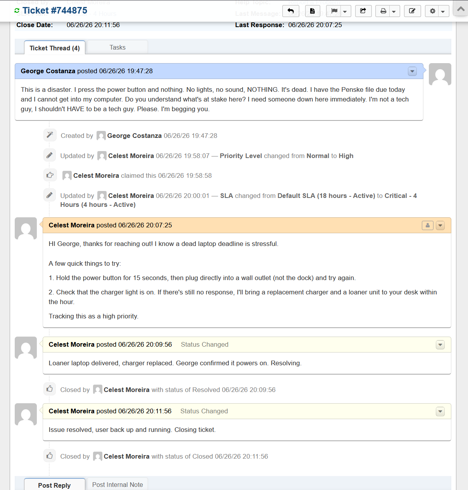
*Full ticket lifecycle in the audit trail — priority raised to High, ticket claimed, SLA escalated to Critical, agent response posted, then resolved and closed.*

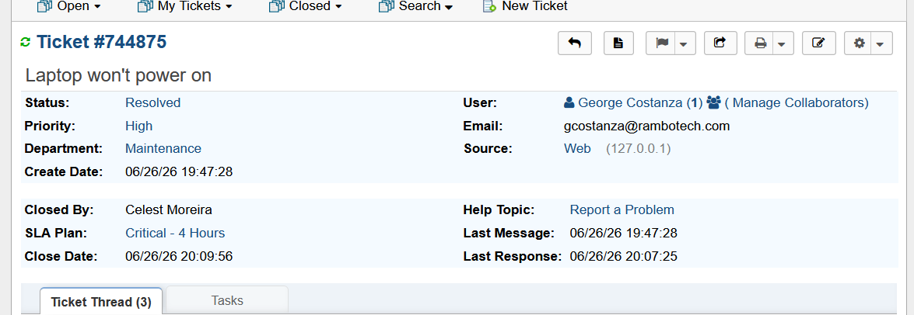
*Resolved ticket showing triage details: High priority, Critical SLA, assigned agent, and full timestamps.*

---

## Part 2: Asset Inventory (SQL)

A MySQL database tracking hardware **assets**, the **employees** they're
assigned to, **locations**, **vendors**, and **warranty status**, plus an
**assignment history** table so onboarding/offboarding is a real workflow.

### Run it
```bash
# in phpMyAdmin, run in order:
sql/01_schema.sql       # builds the database + tables
sql/02_seed_data.sql    # loads sample data
sql/03_queries.sql      # the reporting + onboarding queries
```

### Schema
`locations` · `departments` · `vendors` · `employees` · `assets` · `asset_assignments`

### Query results
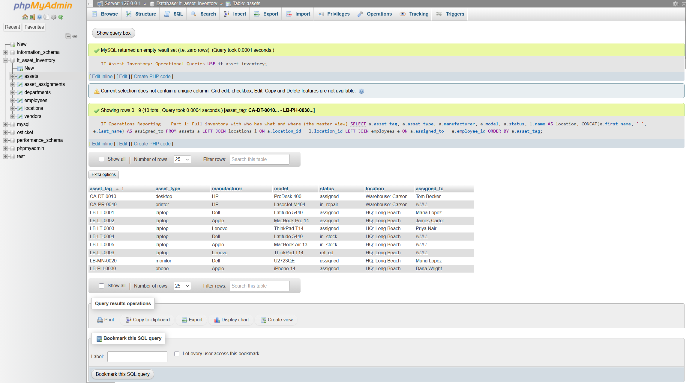
*Master inventory query: every asset with its type, status, location, and assigned user in one view.*

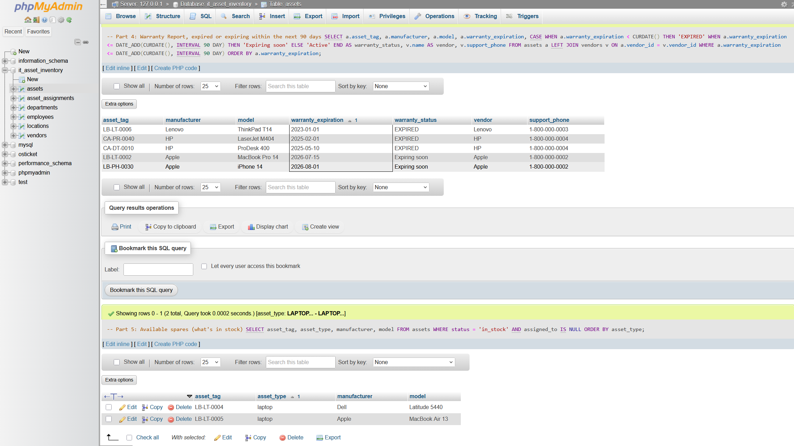
*Warranty status report flagging expired and soon-to-expire hardware, with vendor support contacts (supports proactive replacement).*

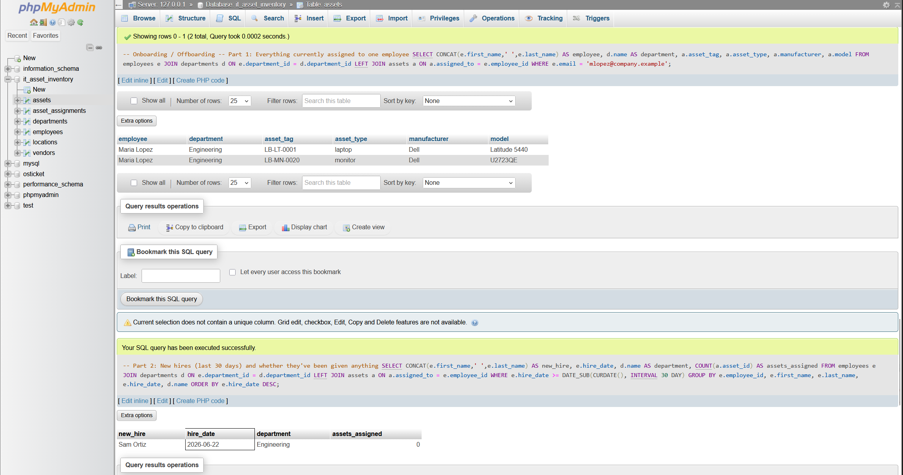
*Onboarding query flagging a new hire (Sam Ortiz) who started recently but hasn't been issued any equipment yet.*

---

## What I learned
- How a ticket actually flows through a help desk: triage, SLA timers, assignment, and resolution, instead of just reading about it.
- Why IT teams track warranty expiration and assignment history, and how a couple of SQL queries turn a raw table into something an operations team can act on.
- A small security-vs-functionality tradeoff: hardening the osTicket config to read-only caused a ticket-lock quirk, which was a good reminder that security changes have side effects.
